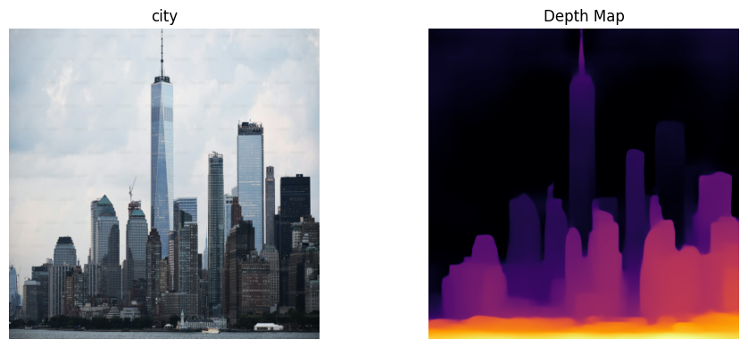

# 🔍 Depth Estimation Using MiDaS (PyTorch)
This project uses **monocular depth estimation** using the **MiDaS deep learning model**, a state-of-the-art deep learning model that predicts scene depth from a **2D RGB image**. It processes a batch of images, generates corresponding depth maps, and optionally saves the results. This implementation is designed for use in a **Jupyter notebook**.


## 📸 Example Outputs
| Original Image vs Depth Map            |
| -------------------------------------- |
|  |


## 📌 Features
- 🔍 High-quality monocular depth estimation (MiDaS)
- 📷 Batch processing of images
- 🎨 Visualization using Matplotlib with customizable colormaps
- 💾 Output storage as .png and optional .npz format
- ⚙️ Configurable parameters for device, model, size, and layout


## 📂 Project Structure
- ├── dataset/                      # Input images
- ├── outputs/                      # Depth map results
- ├── city_example.png              # Image example Original vs Depth
- ├── Depth_Estimation_Midas.ipynb  # Jupyter notebook
- └── README.md                     # Project documentation


## 📂 Dataset
The project expects a folder named `/dataset` containing 30 input RGB images.


## 🔧 Requirements
This project is designed to run on **Jupyter notebook**, but locally you would need:

- `torch`, `torchvision`
- `opencv-python`
- `matplotlib`
- `tqdm`
- `numpy`

You can install them using:

```bash
pip install torch torchvision tqdm matplotlib opencv-python
```


## 🧠 Model: MiDaS (DPT_Large)
We use the `MiDaS v3` model `DPT_Large` (based on Vision Transformers) for best accuracy, loaded via PyTorch Hub:

- Paper: [MiDaS: Robust Monocular Depth Estimation](https://arxiv.org/abs/1907.01341)
- GitHub: [intel-isl/MiDaS](https://github.com/intel-isl/MiDaS)
- Architecture: DPT (Dense Prediction Transformer)

You can easily switch to lighter variants like `DPT_Hybrid` or `MiDaS_small` for faster inference.


## 📦 Output Formats
- NG: Depth maps saved as grayscale images
- NPZ: Combined RGB + depth + metadata for postprocessing


## 📘 Language
- Python
